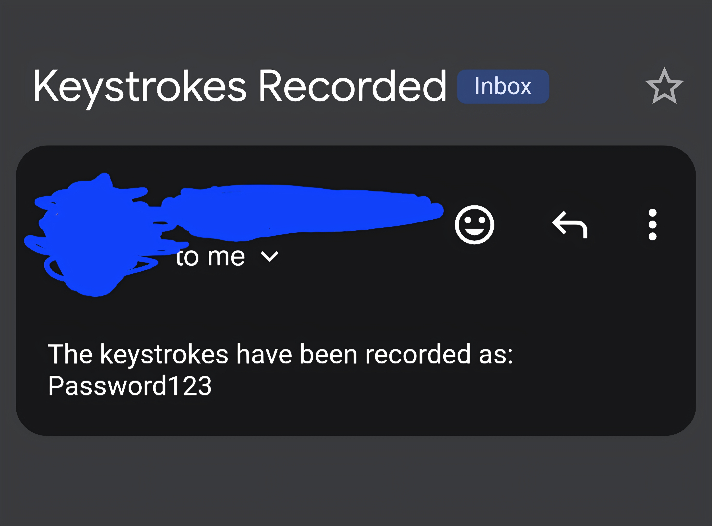

# Key-Logger 👨🏾‍💻🗒️
Python script for a demo of a key logger

Prerequisites:
1. Ensure the latest version of python in installed in your terminal (python 3.x)
2. Ensure you have a virtual env for the required python library (If you don't, one can easily be created by executing the command "python3 -m venv env")
3. Create an app password for your Google account that'll be used as the value for one of your .env variables

Installation & Execution:
* To install, simply type "git clone https://github.com/RavenTheBird789/Key-Logger" in your terminals command line

1. After installing, use the command "cd Key-Logger" to enter the Key-Logger directory
2. Once in the directory, activate your env with the command "source env/bin/activate"
3. After your env is activated, run the command "pip install -r requirements.txt" to install the required library
4. After installing the required library, create a .env text file to store your MY_EMAIL and PASSWORD variables along with their corresponding values
5. Take the app password created for your Google account and paste it as the value for the PASSWORD variable in your .env text file
   
* To run, simply type "python3 key_logger.py" in your terminals command line or use the bash alias command to create a shortcut to run the program in your terminal such as "alias keylog="python3 key_logger.py""

Notes:
* KeyboardInturrupt (Ctrl + C) can be used to terminate the program easily within the terminal session
* It is highly recommended to use a burner email/Google account for configuring the .env text file variables values for this tool
