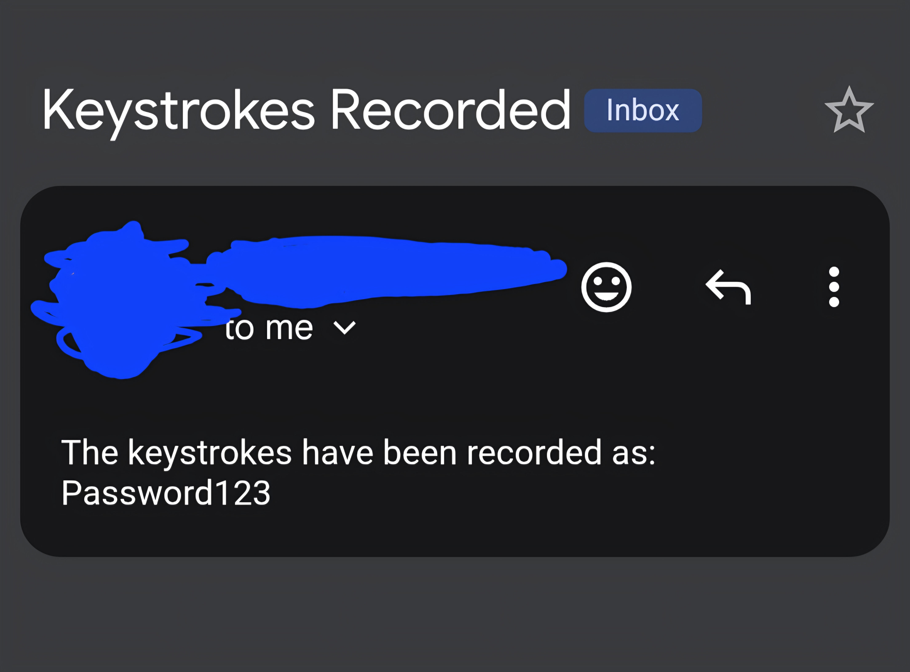

# Key-Logger 👨🏾‍💻🗒️
Python script for a demo of a key logger



Requirements:
1. Ensure the latest version of python in installed in your terminal (python 3.x)
2. Ensure you have a virtual env for the required python library (If you don't, one can easily be created by executing the command "python3 -m venv env")
3. Create an app password for your Google account that'll be used as the value for one of your .env variables

Installation & setup:

```bash
git clone https://github.com/RavenTheBird789/Key-Logger
cd Key-Logger
python3 -m venv env
source env/bin/activate
pip install -r requirements.txt
```

1. After installing the required library, create a .env text file to store your MY_EMAIL and PASSWORD variables along with their corresponding values
2. Take the app password created for your Google account and paste it as the value for the PASSWORD variable in your .env text file

To run

```bash
python3 key_logger.py
```

Optional shortcut

```bash
alias keylog="python3 key_logger.py"
```

Notes:
* KeyboardInturrupt (Ctrl + C) can be used to terminate the program easily within the terminal session
* It is highly recommended to use a burner email/Google account for configuring the .env text file variables values for this tool
